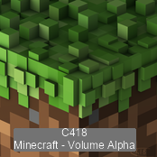
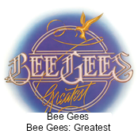

## 👋 I'm Jason Vu, WED DEV @ SCU 2024! Welcome to my Github portfolio! 

⚡ I'm a Web Design and Engineering major with interests in full-stack development, information technology, and human-computer interface design.

💻 Obsessed with technology and the intuitive user-computer design process, I’m a resourceful individual who’s passionate about the computing industry in the Silicon Valley.

🙋‍♂️ I am enthusiastic to face new challenges and possibilities, so don't hesitate to contact me if our interests align!

🤝 ***"The sum of our parts, the beat of our hearts, is louder than words..."***
> Pink Floyd

## My Github Statistics So Far!

## Find Me Around the Web! 🌎
- Sending my [resume](https://javab3ans.github.io/pdfs/resume.pdf) to you ! 📝
- Connecting with professional networks on [Linkedin](https://www.linkedin.com/in/jason-anh-vu/) and [Handshake](https://scu.joinhandshake.com/stu/users/25718798) 💼!

## 👋 I'm Jason Vu, WED DEV @ SCU 2024! Welcome to my Github portfolio! 

⚡ I'm a Web Design and Engineering major with interests in full-stack development, information technology, and human-computer interface design.

💻 Obsessed with technology and the intuitive user-computer design process, I’m a resourceful individual who’s passionate about the computing industry in the Silicon Valley.

🙋‍♂️ I am enthusiastic to face new challenges and possibilities, so don't hesitate to contact me if our interests align!

🤝 ***"The sum of our parts, the beat of our hearts, is louder than words..."***
> Pink Floyd

## My Github Statistics So Far!

## Find Me Around the Web! 🌎
- Sending my [resume](https://javab3ans.github.io/pdfs/resume.pdf) to you ! 📝
- Connecting with professional networks on [Linkedin](https://www.linkedin.com/in/jason-anh-vu/) and [Handshake](https://scu.joinhandshake.com/stu/users/25718798) ! 💼  

## Albums I've Listened to the Most This Week 🎹 

<!-- lastfm -->

    

