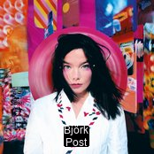
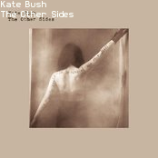

## 👋 I'm Jason Vu, Aspiring Software Dev @ SCU 2024!

⚡ I'm a Web Design and Engineering major with interests in full-stack development, information technology, and human-computer interface design.

💻 Obsessed with technology and the intuitive user-computer design process, I’m a resourceful individual who’s passionate about the computing industry in the Silicon Valley.

🙋‍♂️ I am enthusiastic to face new challenges and possibilities, so don't hesitate to contact me if our interests align!

🤝 ***"The sum of our parts, the beat of our hearts, is louder than words..."***
> Pink Floyd

## My Github Statistics So Far!

## Find Me Around the Web! 🌎
- Here's my [website](https://javab3ans.github.io/portfolio) and [resume](https://javab3ans.github.io/portfolio/resume.html) ! 📝
- Connecting with professional networks on [Linkedin](https://www.linkedin.com/in/jason-anh-vu/)  ! 💼  

## Albums I've Listened to the Most This Week 🎹 

<!-- lastfm -->

        

